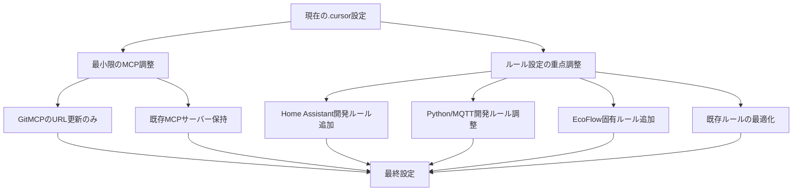
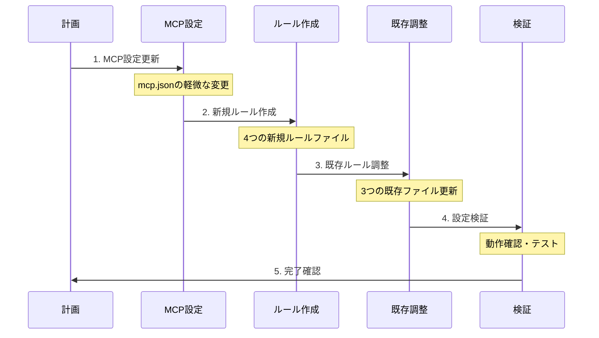

# EcoFlow Cloud Home Assistant プロジェクト用 `.cursor` 設定最適化計画

## プロジェクト概要

**プロジェクト名:** EcoFlow Cloud Integration for Home Assistant
**リポジトリ:** https://github.com/tolwi/hassio-ecoflow-cloud
**技術スタック:** Python 3.12+, Home Assistant, MQTT, Protocol Buffers
**目的:** EcoFlowデバイス用Home Assistantカスタムコンポーネント

## 現状分析

### 既存の`.cursor`設定
- 別プロジェクト（image-annotator-lib）から移植
- 複数のMCPサーバー設定済み
- 汎用的なルールファイル群

### 対象デバイス
- DELTA シリーズ（DELTA_2, DELTA_PRO, DELTA_MAX等）
- RIVER シリーズ（RIVER_2, RIVER_MAX, RIVER_PRO等）
- PowerStream, Glacier, Wave2等

## 最適化戦略



## 実装計画

### 1. MCP設定の最小限調整

#### 変更対象
```json
{
  "image-annotator-lib Docs": {
    "command": "npx",
    "args": [
      "mcp-remote",
      "https://gitmcp.io/NEXTAltair/image-annotator-lib"
    ]
  }
}
```

#### 変更後
```json
{
  "hassio-ecoflow-cloud Docs": {
    "command": "npx",
    "args": [
      "mcp-remote",
      "https://github.com/NEXTAltair/hassio-ecoflow-cloud"
    ]
  }
}
```

#### 保持するMCPサーバー
- `perplexity-mcp` - 技術調査・問題解決
- `perplexity-ask` - 開発支援・質問応答

### 2. 新規ルールファイル作成

#### 2.1 `homeassistant-component.mdc`
**目的:** Home Assistantカスタムコンポーネント開発ルール

**内容:**
- manifest.json管理ルール
- config_flow実装パターン
- エンティティ定義ガイドライン
- サービス登録手順
- HACS対応ルール

#### 2.2 `mqtt-development.mdc`
**目的:** MQTT通信開発ルール

**内容:**
- EcoFlow MQTT接続パターン
- メッセージ処理ルール
- 認証・セキュリティ管理
- 接続エラーハンドリング
- 非同期処理パターン

#### 2.3 `ecoflow-devices.mdc`
**目的:** EcoFlowデバイス固有ルール

**内容:**
- デバイス定義パターン
- センサー/スイッチ実装ルール
- データマッピング手法
- デバイス固有機能実装
- 新デバイス追加手順

#### 2.4 `protobuf-handling.mdc`
**目的:** Protocol Buffers処理ルール

**内容:**
- .protoファイル管理
- メッセージ変換パターン
- バイナリデータ処理
- バージョン管理ルール
- パフォーマンス最適化

### 3. 既存ルールファイル調整

#### 3.1 `directory-structure.mdc`
**調整内容:**
- Home Assistantプロジェクト構造に特化
- custom_components構造ルール
- テストディレクトリ構造
- ドキュメント構造

#### 3.2 `implement.mdc`
**調整内容:**
- Python/MQTT実装パターン
- 非同期処理ベストプラクティス
- エラーハンドリングパターン
- ログ出力ルール

#### 3.3 `debug.mdc`
**調整内容:**
- Home Assistant開発環境デバッグ
- MQTT通信デバッグ手法
- Protocol Buffersデバッグ
- デバイス通信トラブルシューティング

## 実装手順



### ステップ1: MCP設定更新
- [ ] `.cursor/mcp.json`の更新
- [ ] GitMCPサーバーURL変更
- [ ] 設定の動作確認

### ステップ2: 新規ルール作成
- [ ] `homeassistant-component.mdc`作成
- [ ] `mqtt-development.mdc`作成
- [ ] `ecoflow-devices.mdc`作成
- [ ] `protobuf-handling.mdc`作成

### ステップ3: 既存ルール調整
- [ ] `directory-structure.mdc`更新
- [ ] `implement.mdc`更新
- [ ] `debug.mdc`更新

### ステップ4: 検証・テスト
- [ ] MCP接続テスト
- [ ] ルール適用テスト
- [ ] 開発ワークフロー確認

## 期待される効果

### 開発効率向上
- Home Assistant特化の開発支援
- EcoFlowデバイス固有の知識ベース
- MQTT/Protocol Buffers開発支援

### コード品質向上
- 一貫した実装パターン
- エラーハンドリングの標準化
- テスト・デバッグ手法の統一

### 保守性向上
- 明確なディレクトリ構造
- ドキュメント化されたルール
- 新デバイス追加の標準化

## 注意事項

- MCP設定は最小限の変更に留める
- 既存の開発ワークフローを尊重
- 段階的な導入でリスクを最小化
- 定期的な設定見直しを実施

---

**作成日:** 2025-05-26
**対象プロジェクト:** hassio-ecoflow-cloud
**計画バージョン:** 1.0