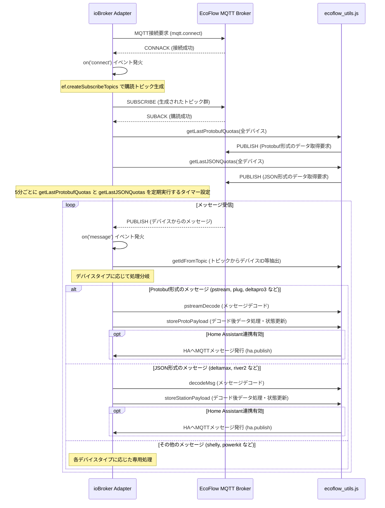
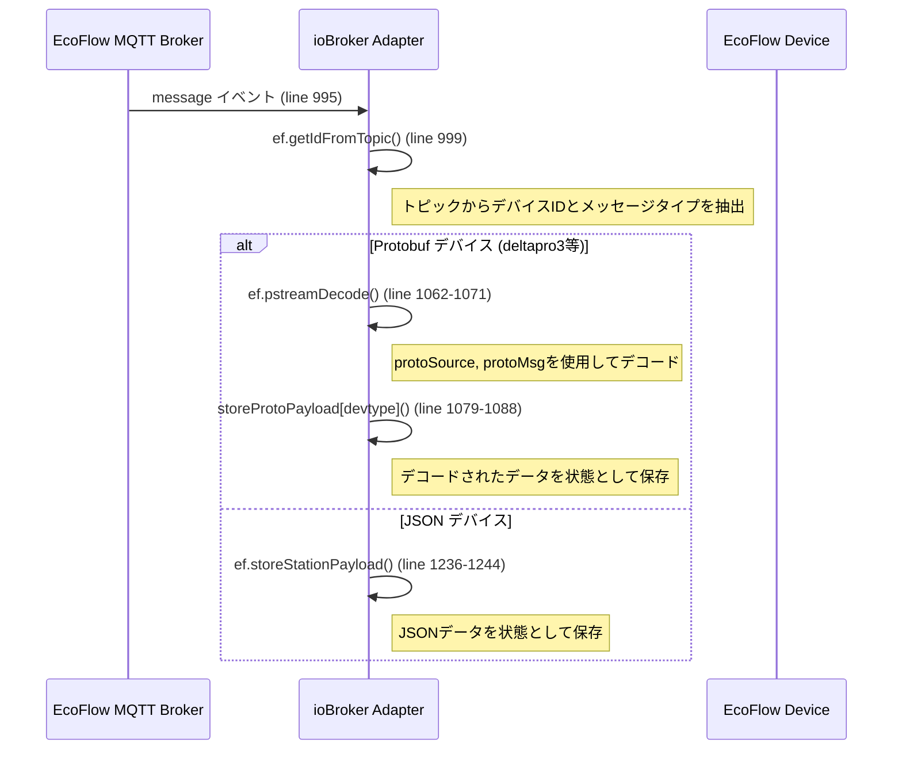
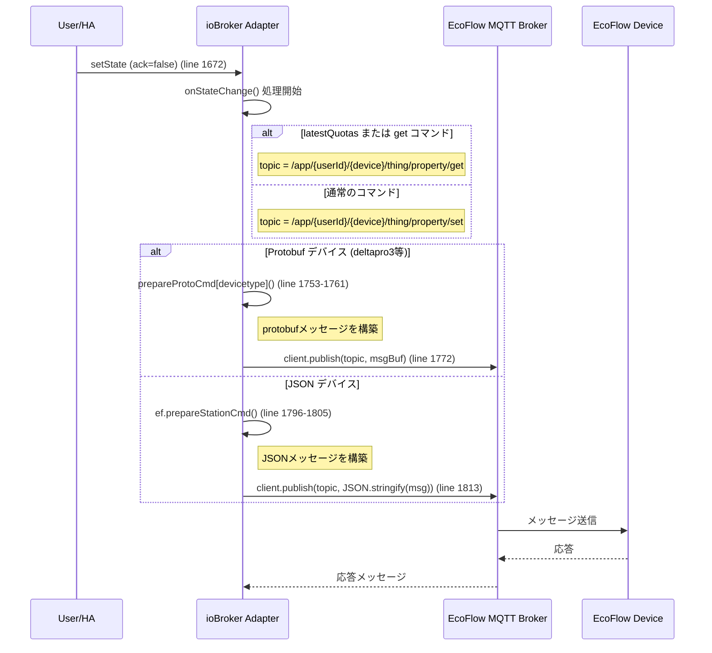

# ioBroker.ecoflow-mqtt MQTT 接続・初期化シーケンス分析

## 概要

ioBroker.ecoflow-mqtt の`main.js`における MQTT 接続と初期化シーケンスを詳細に分析し、EcoFlow Delta Pro 3 との通信で必要な手順を特定する。

## 主要な発見

### 1. MQTT 接続シーケンス



### 2. 重要な初期化手順

**line 978-983 で実行される重要な初期化:**

```javascript
// 初回実行
await ef.getLastProtobufQuotas(this, this.pdevices);
await ef.getLastJSONQuotas(this, this.pdevices);

// 定期実行 (5分間隔)
lastQuotInterval = this.setInterval(async () => {
  await ef.getLastProtobufQuotas(this, this.pdevices);
  await ef.getLastJSONQuotas(this, this.pdevices);
}, 300 * 1000); // 5分
```

### 3. メッセージ受信処理



### 4. コマンド送信処理



## Delta Pro 3 固有の処理

### 1. デバイスタイプ判定 (line 160-161, 303-309)

```javascript
// デバイス状態定義の読み込み
else if (devtype === 'deltapro3') {
    devStates = require('./lib/dict_data/ef_deltapro3_data.js').deviceStates;
}

// Protobuf関連の設定
else if (devtype === 'deltapro3') {
    pdevicesStatesDict = require('./lib/dict_data/ef_deltapro3_data.js').deviceStatesDict[devtype];
    pdevicesCmd = require('./lib/dict_data/ef_deltapro3_data.js').deviceCmd[devtype];
    protoSource = require('./lib/dict_data/ef_deltapro3_data.js').protoSource;
    protoMsg = require('./lib/dict_data/ef_deltapro3_data.js').protoMsg;
    storeProtoPayload = require('./lib/dict_data/ef_deltapro3_data.js').storeProtoPayload;
    prepareProtoCmd = require('./lib/dict_data/ef_deltapro3_data.js').prepareProtoCmd;
}
```

### 2. Protobuf メッセージ処理 (line 1041, 1708)

Delta Pro 3 は以下の条件で Protobuf デバイスとして処理される:

```javascript
// メッセージ受信時の判定
if (devtype === 'pstream' ||
    devtype === 'plug' ||
    devtype === 'deltaproultra' ||
    devtype === 'powerocean' ||
    devtype === 'panel2' ||
    devtype === 'alternator' ||
    devtype === 'deltapro3' ||  // ← ここ
    devtype === 'delta3' ||
    devtype === 'delta3plus' ||
    devtype === 'river3' ||
    devtype === 'river3plus')

// コマンド送信時の判定
case 'pstream600':
case 'pstream800':
case 'plug':
case 'deltaproultra':
case 'powerocean':
case 'panel2':
case 'alternator':
case 'deltapro3':  // ← ここ
case 'delta3plus':
case 'delta3':
case 'river3plus':
case 'river3':
```

## 問題の可能性

### 1. getLastProtobufQuotas 関数の詳細が不明

現在の Python スクリプトでは、ioBroker が実行している`ef.getLastProtobufQuotas()`の詳細な実装を再現していない可能性がある。

### 2. 購読トピックの違い

ioBroker が購読しているトピックと、Python スクリプトが購読しているトピックに差異がある可能性がある。

### 3. 初期化シーケンスの不完全性

ioBroker では以下の順序で初期化が行われる:

1. MQTT 接続
2. トピック購読
3. **即座に** `getLastProtobufQuotas()` 実行
4. **即座に** `getLastJSONQuotas()` 実行
5. 定期実行の設定

現在の Python スクリプトでは、3 と 4 の処理が不完全または異なる可能性がある。

## 推奨される次のステップ

1. **`ef.getLastProtobufQuotas()`関数の詳細分析**

   - `lib/ecoflow_utils.js`の該当関数を調査
   - Delta Pro 3 での具体的な実装を確認

2. **購読トピックの再確認**

   - `ef.createSubscribeTopics()`の実装を調査
   - 実際に購読されるトピック一覧を確認

3. **初期化メッセージの詳細分析**

   - `prepareProtoCmd`の`latestQuotas`実装を詳細調査
   - 送信されるメッセージの正確な構造を確認

4. **メッセージ送信タイミングの調整**
   - 接続後即座に quotas 取得を実行
   - 定期実行も設定

## ioBroker.ecoflow-mqtt MQTT 接続・初期化・メッセージ受信シーケンス

`ioBroker.ecoflow-mqtt/main.js` における MQTT 接続 (`this.client.on('connect', ...)`) およびメッセージ受信 (`this.client.on('message', ...)`) の主な処理フローは以下の通りです。

```mermaid
sequenceDiagram
    participant Adapter as ioBroker Adapter (main.js)
    participant MQTTBroker as EcoFlow MQTT Broker
    participant Utils as ecoflow_utils.js
    participant Device as EcoFlow Device (e.g., Delta Pro 3)

    Adapter->>MQTTBroker: MQTT接続要求 (mqtt.connect)
    MQTTBroker-->>Adapter: CONNACK (接続成功)
    Adapter->>Adapter: on('connect') イベント発火
    Note over Adapter: ef.createSubscribeTopics で購読トピック生成
    Adapter->>MQTTBroker: SUBSCRIBE (生成されたトピック群)
    MQTTBroker-->>Adapter: SUBACK (購読成功)
    Adapter->>Utils: getLastProtobufQuotas(全デバイス対象)
    Utils->>MQTTBroker: PUBLISH (Protobuf形式のデータ取得要求 /thing/property/set)
    Adapter->>Utils: getLastJSONQuotas(全デバイス対象)
    Utils->>MQTTBroker: PUBLISH (JSON形式のデータ取得要求)

    Note over Adapter: 定期的なデータ取得タイマー開始 (ef.getLastProtobufQuotas, ef.getLastJSONQuotas)

    Device-->>MQTTBroker: PUBLISH (デバイスからのメッセージ /app/device/property/{SN} や /app/{UID}/{SN}/thing/property/get_reply など)
    MQTTBroker-->>Adapter: MQTT メッセージ受信
    Adapter->>Adapter: on('message') イベント発火
    Adapter->>Utils: ef.getIdFromTopic(トピック, UID) // デバイスSNとメッセージタイプ特定
    opt DeltaPro3 (Protobuf形式の場合)
        Adapter->>Utils: ef.pstreamDecode(メッセージ, protoSource, protoMsg) // Protobufデコード
        Adapter->>Utils: storeProtoPayload[devtype](デコード後データ) // 状態保存・HA通知
    else JSON形式の場合
        Adapter->>Utils: storeStationPayload等(メッセージ) // JSON処理・状態保存・HA通知
    end

```

### `on('connect')` イベントハンドラ内の処理 (main.js L970-)

1.  **接続成功ログ出力**
2.  **トピック購読:**
    - `ef.createSubscribeTopics(this.mqttUserId, this.pdevices)` を呼び出して、設定されている全デバイスの標準的な購読トピックリストを生成します。
    - 生成されたトピック群を MQTT ブローカーに購読 (SUBSCRIBE) します。
3.  **初期データ取得要求:**
    - `ef.getLastProtobufQuotas(this, this.pdevices)` を呼び出し、Protobuf 形式で全量データを要求するメッセージを全デバイスに送信します。
      - 送信先トピック: `/app/{USER_ID}/{DEVICE_SN}/thing/property/set`
    - `ef.getLastJSONQuotas(this, this.pdevices)` を呼び出し、JSON 形式で全量データを要求するメッセージを全デバイスに送信します。
4.  **定期的なデータ取得タイマー設定:**
    - `setInterval` を使用して、一定間隔 (デフォルト 300 秒=5 分) で `ef.getLastProtobufQuotas` と `ef.getLastJSONQuotas` を再度呼び出し、定期的に全デバイスのデータを更新するタイマーを設定します。
5.  **アダプター状態更新:** `info.connection` を `true` に設定します。

**特記事項:**

- `on('connect')` ハンドラ内には、特定のデバイスタイプ (例: `DeltaPro3`) に固有の特別な初期化メッセージ送信処理は見当たりませんでした。全デバイスに対して同様の初期データ取得要求が送信されます。

### `on('message')` イベントハンドラ内の処理 (main.js L995-)

1.  **トピック解析:**
    - `ef.getIdFromTopic(topic, this.mqttUserId)` を使用して、受信トピックからデバイスのシリアル番号とメッセージタイプ (例: `update`, `get_reply`) を特定します。
2.  **デバイスタイプ特定:**
    - アダプターの設定 (`this.pdevices`) から、特定されたシリアル番号に対応するデバイスタイプ (`devtype`) を取得します。
3.  **メッセージ形式による分岐:**
    - **Protobuf 形式で処理されるデバイス (DeltaPro3 など):**
      - `devtype` が `pstream`, `plug`, `deltaproultra`, `powerocean`, `panel2`, `alternator`, `deltapro3`, `delta3`, `delta3plus`, `river3`, `river3plus` のいずれかの場合。
      - `ef.pstreamDecode(...)` を使用して、受信した Protobuf メッセージをデコードします。この際、デバイスタイプに対応する `protoSource` (スキーマ) と `protoMsg` (メッセージ定義) が参照されます。
      - デコード成功後、`this.storeProtoPayload[devtype](...)` (デバイスタイプ別のペイロード処理関数。例: `deltapro3` の場合は `ef_deltapro3_data.js` 内の `storeProtoPayload`) を呼び出し、デコードされたデータを ioBroker の状態として保存し、必要に応じて Home Assistant (HA) にも通知します。
    - **JSON 形式で処理されるデバイス:**
      - 上記以外のデバイスタイプの場合。
      - デバイスタイプに応じて、`ef.storeStationPayload(...)`, `ef.storeSHPpayload(...)` などの関数を呼び出し、JSON データを処理して ioBroker の状態を更新し、HA に通知します。

**特記事項:**

- `on('message')` ハンドラ内にも、`DeltaPro3` (`devtype === 'deltapro3'`) の場合に特化した条件分岐や、他の Protobuf 対応デバイスと大きく異なる専用の処理フローは見当たりませんでした。
- `DeltaPro3` からのメッセージは、他の多くの最新デバイスと同様に、汎用の Protobuf デコード処理と、デバイス定義ファイル (`ef_deltapro3_data.js`) に記述されたペイロード保存ロジックによって処理されます。
- これは、アダプターが `DeltaPro3` から特定の Protobuf 形式のメッセージが、期待されるトピック (例: `/app/device/property/{DEVICE_SN}` や `/app/{USER_ID}/{DEVICE_SN}/thing/property/get_reply`) で送信されてくることを前提としていることを示しています。

## `ecoflow_utils.js` における詳細なペイロード処理の発見 (2025-05-28 追記)

`ioBroker.ecoflow-mqtt/lib/ecoflow_utils.js` 内の `pstreamDecode` 関数および関連する処理を詳細に分析した結果、以下の重要な点が判明しました。これらは `scripts/mqtt_capture_dp3_debug.py` でのメッセージデコード処理を実装する上で非常に重要です。

1.  **Base64 デコードの必須性:**

    - `pstreamDecode` (L218 付近) では、入力された MQTT ペイロード (`payload`) を最初に `Buffer.from(payload, 'base64')` を用いて Base64 デコードしています。
    - これは、デバイスから送信される生の Protobuf メッセージが、実際には Base64 エンコードされていることを意味します。現在の Python スクリプトでは、`/app/device/property/{SN}` トピックのメッセージに対して Base64 デコードを試行していますが、これが正しい処理であることが裏付けられました。

2.  **`HeaderMessage` によるペイロードのラップ:**

    - Base64 デコードされたデータは、`protoSource.HeaderMessage.decode(buf)` (L226 付近) を使用して `HeaderMessage` 型としてデコードされます。
    - `HeaderMessage` は、内部に `header` という `repeated Header` フィールドを持つ構造です (proto 定義参照)。つまり、1 つの MQTT メッセージペイロード内に複数の `Header` オブジェクトが含まれうる構造になっています。
    - Python スクリプトでは、受信したペイロードを直接 `Header` や具体的なデータ型 (`set_dp3` など) でデコードしようとしている可能性がありますが、まず `HeaderMessage` としてデコードし、その中の各 `Header` を処理する形にする必要があります。

3.  **XOR デコードの具体的な条件:**

    - 各 `Header` オブジェクト内の `pdata` (ペイロード本体、`bytes` 型) は、特定の条件下で XOR デコードされます (L235-L242 付近)。
    - 条件: `item.encType === 1 && item.src !== 32`
      - `item` は `HeaderMessage.header` 内の各 `Header` オブジェクトを指します。
      - `encType === 1` は暗号化 (XOR) が有効であることを示します。
      - `src !== 32` は、送信元 (src) が 32 (通常はサーバーからのメッセージを示す) ではない、つまりデバイスからのメッセージであることを示す条件と考えられます。
    - XOR キー: `item.seq` (各 `Header` に含まれるシーケンス番号)
    - Python スクリプトの `xor_decode_pdata` 関数は、この条件とキーを正確に反映させる必要があります。

4.  **`cmdId` / `cmdFunc` とペイロード型のマッピング:**

    - XOR デコード後 (または不要な場合) の `pdata` を、どの具体的な Protobuf 型 (`set_dp3`, `get_dp3` など) でデコードするかは、`Header` 内の `cmdId` と `cmdFunc` によって決定されます (L255-L266 付近、`storeProtoPayload` 関数の呼び出し元である `pstreamDecode` 内での型特定ロジック)。
    - `protoMsg[devtype][item.cmdId][item.cmdFunc]` のようにして、デバイスタイプ (`devtype`)、`cmdId`、`cmdFunc` をキーとして、対応する Protobuf メッセージ型 (`msgType`) と処理関数 (`handler`) が `ef_deltapro3_data.js` の `protoMsg` 定義から取得されます。
    - 取得された `msgType` を用いて `pdata` がデコードされます (例: `protoSource[msgType].decode(pdata)` )。
    - Python スクリプトでは、このマッピングロジックを実装し、受信した `Header` の `cmdId` と `cmdFunc` に基づいて動的にデコード型を決定する必要があります。

5.  **`latestQuotas` (データ取得要求) に対する応答の処理:**
    - Python スクリプトから `latestQuotas` に相当するメッセージ (例: `cmdId: 255, cmdFunc: 2` を `setHeader` に設定した `setMessage`) を送信した場合、その応答は `/app/{USER_ID}/{SN}/thing/property/get_reply` や `/app/{USER_ID}/{SN}/thing/property/set_reply` などのトピックで返ってくると期待されます。
    - ioBroker の `pstreamDecode` のロジックに基づくと、これらの応答メッセージのペイロードも Base64 エンコードされており、`HeaderMessage` でラップされている可能性があります。
    - 応答の `Header.pdata` には、要求したデータ (全パラメータの状態など) が含まれていると推測されます。この `pdata` も、`Header.encType`, `Header.src`, `Header.seq`, `Header.cmdId`, `Header.cmdFunc` に基づいて、適切に XOR デコードと型特定を行う必要があります。多くの場合、応答データはデバイス固有の包括的な型 (例: `set_dp3` や `get_dp3`) でエンコードされていると考えられます。

これらの発見は、Python スクリプトがデバイスからのメッセージを正しくデコードし、内容を理解するための鍵となります。特に、Base64 デコード、`HeaderMessage` の処理、条件付き XOR デコード、`cmdId`/`cmdFunc` に基づく動的な型特定は、現在のスクリプトに欠けているか、不完全である可能性が高い処理です。
